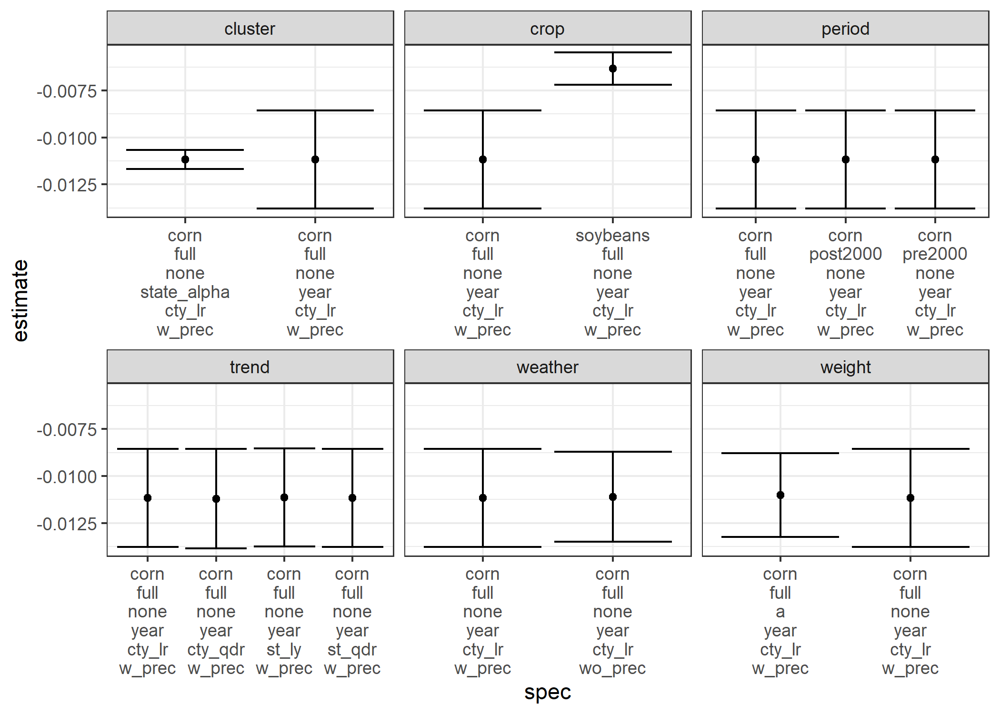

```{r setup, include=FALSE}
knitr::opts_chunk$set(echo = TRUE, message = FALSE, warning = F, cache = T, root.dir ="C:/Users/Seunghyun Lee/Dropbox/Teaching/ARE231_2021")
library(dplyr)
library(sf)
```


# Outline of R scripts

## Create setup files

```{r, eval=FALSE}
rscript_to_create <- c(
  "Code/000_master.R",
  "Code/001_packages.R",
  "Code/002_functions.R",
  "Code/003_parameters_public.R",
  "Code/004_parameters_private.R"
)

lapply(rscript_to_create, file.create)

```

## master.R

```{r, eval=F, code=readLines("Code/000_master.R")}

```

## packages.R

```{r, eval=T, code=readLines("Code/001_packages.R")}

```

## functions.R


```{r, results=F, eval=T, code=readLines("Code/002_functions.R")}

```

I draw maps a lot. County boundaries and state boundaries are always in my `functions.R`.

```{r}

sf_3I <- cb %>% filter(STATEFP %in% 17:19) 
plot(sf_3I[,"geometry"])

```


## parameters_public.R
```{r, eval=T, code=readLines("Code/003_parameters_public.R")}

```


`004_parameters_private.R` includes nothing but `par$apikey <- "my NASS api key"`

# Crop yield model

## To do list
1.  Download annual county-level yield and acreage data for corn (for
    grain) and soybeans for all counties in the I states from the USDA
    NASS quickstats for the period 1981-2019. (Note: There are multiple
    ways of doing this. I would like your workflow to be reproducible and automated, meaning that executing your script downloads all data you need at once. Please feel free to refer to [Accessing Ag Data Using R](https://asmith.ucdavis.edu/data/meta))

2.  Download weather data by clicking `Download All Monthly Data` from [US
    County Weather](https://asmith.ucdavis.edu/data/weather) once the
    app is fully loaded. (In a few weeks later, we are going to learn
    how to construct this data using the gridded daily temperature data
    from the PRISM Climate Group, county boundaries, and crop frequency
    map)

3.  Using the data you downloaded, create a crop-county-year level panel
    dataset that contains columns of yield and weather variables necessary for your regressions. This will involve some data cleaning. (Tip: You can construct annual $gdd$ or $hdd$ by summing monthly degree days over the growing season (April to September))

4.  Before running regressions, do some data exploration to check your
    data. You can compare your data with [US
    Crops](https://asmith.ucdavis.edu/data/us-crops).

5.  Run regressions for the following combinations.

    -   crop : 1) corn, 2) soybeans

    -   period : 1) full (1981-2019), 2) pre 2000 (1981-2000), 3) post 2000
    (2001-2019),

    -   regression weights : 1) no weight, 2) acreage

    -   cluster standard errors  by: 1) year, 2) state

    -   time trend : 1) county-specific linear, 2) state-specific linear, 3)
    county-specific quadratic, 4) state-specific quadratic

    -   weather variables : 1) (with precipitation) $prec$, $prec^2$, $gdd$ and $hdd$, 2) (without precipitation) $gdd$ and $hdd$ 
    
    
That is, you have $2\times 3\times 2 \times 2\times 4\times 2 = 192$ regression results.


6. Let's focus on $\beta_4$. 
    
    - Obtain $\hat{\beta}_4$s and calculate their confidence intervals.
    - Compare $\hat{\beta}_4$s and their confidence intervals by changing one dimension at a time. (i.e., compare $\hat{\beta}_4$s for different crops 1) corn and 2) soybeans while keeping 1) for all the other dimensions).
    - Do you find any systematic differences between models in any dimensions? If so, what are they? Are they consistent with your intuition? 
    
## Cleaned Data


```{r}

df_weather <- readRDS("Data/Processed/df_weather.rds")
head(df_weather)

df_ya <- readRDS("Data/Processed/df_ya.rds")
head(df_ya)

df <- left_join(df_ya, df_weather, by = c("fips", "year"))
head(df)


vis_miss(df)
summary(df)
```

## Result

<div align="center">

**$\hat{\beta}s$ and their CIs **

</div>




## Code

### 100_download and clean yield and acreage.R
```{r, results=F, eval=F, code=readLines("Code/100_download and clean yield and acreage.R")}


```


### 110_construct annual county-level weather.R
```{r, results=F, eval=F, code=readLines("Code/110_construct annual county-level weather.R")}

```

### 120_exploratory data visualization.R

```{r, results=F, eval=T, code=readLines("Code/120_exploratory data visualization.R")}


```

### 130_analysis.R
```{r, results=F, eval=F, code=readLines("Code/130_analysis.R")}


```


```{css, echo = FALSE}


table, td, th {
  border: none;
  padding-left: 1em;
  padding-right: 1em;
  margin-left: auto;
  margin-right: auto;
  margin-top: 1em;
  margin-bottom: 1em;
}

```

<style type="text/css">

h1.title {
  text-align: center;
  font-size: 38px;
  color: DarkBlue;
  font-weight: bold;
}
h3.subtitle {
  text-align: center;
  font-size: 20px;
  color: DarkRed;
  font-weight: bold;
}
h4.author{
  text-align: right;
  font-size: 16px;
  font-weight: bold;
}
h4.date{
  text-align: right;
  font-size: 16px;
  font-weight: bold;
}
h1 { /* Header 1 */
  font-size: 22px;
  color: DarkBlue;
  font-weight: bold;
}
h2 { /* Header 2 */
  font-size: 18px;
  color: DarkBlue;
  font-weight: bold;
}
h3 { /* Header 3 */
  font-size: 14px;
  color: DarkBlue;
  font-weight: bold;
}

body{
  font-family: Times, serif;
  font-size: 16px;
}


</style>

    
