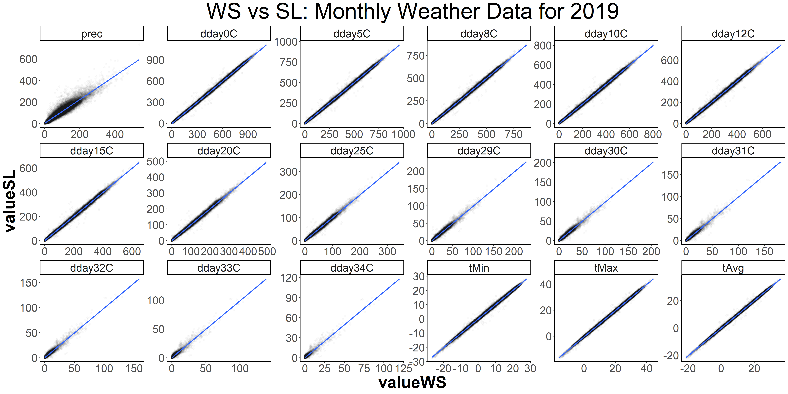

```{r setup, include=FALSE}
knitr::opts_chunk$set(echo = TRUE, cache = TRUE, warning = FALSE, message = FALSE, cache.lazy = FALSE)
```

This document includes some pieces (R codes + figure) that you may find useful when constructing county-level data for degree days. The codes in this document are intended to be illustrative. As mentioned in the class, the tricky part is constructing a cropland weighting layer on the PRISM grid cells. I included this part in the exercise not because I presume you will frequently do this but because it illustrates the point that some geosptial operations could be specific to data type. If you need some geospatial operations that are allowed only for the data type you don't have, you might need to convert your data type. 


The scripts below generalizes the small pieces included in this document to create the daily county-level weather data in 2019 and 2020 for all the counties in the Contiguous US. Constructed weather variables include precipitation, and degree days above 0, 5, 8, 10, 12, 15, 20, 25, 29, 30, 31, 32, 33 and 34 degree Celsius. Note that in the last two scripts I use `data.table` more extensively than in the class. `data.table` is powerful when dealing with a large dataset.


```{r}
list.files("Code/", pattern = "^1") %>% sort()
```

The figure below shows a comparison between my weather data and Professor Schlenker's for 2019 at the county-by-month level. Because of different choices we made in the process of data construction, there are some differences. 





# Aggregate land cover to the PRISM grid

```{r}
source("Code/001_packages.R")
source("Code/002_functions.R")

```

## Load PRISM data
```{r}
file_list <- list.files("Data/Raw/prism/",
                        full.names = T,
                        pattern = "t.*2019071.*bil$", 
                        recursive = TRUE) %>% 
  sort()
file_list
length(n)
```

```{r}
prism_S <- file_list %>% 
  lapply(raster) %>%
  stack()
crs(prism_S)
```

## Choose study area
```{r,  class.output="scroll"}
il_cb <- cb %>%
  filter(STATEFP %in% "17") %>% 
  st_transform(crs(prism_S))

il_cb
attributes(il_cb)
plot(il_cb[, "geometry"])
```

## Load land cover data

```{r,  class.output="scroll"}
nlcd_R <- raster("Data/Raw/nlcd_2019_land_cover_l48_20210604/nlcd_2019_land_cover_l48_20210604.img")

nlcd_R
plot(nlcd_R)


attributes(nlcd_R)
land_class_table <- data.table(attributes(nlcd_R)$data@attributes[[1]])
land_class_table$NLCD.Land.Cover.Class %>% unique()
land_class_table[NLCD.Land.Cover.Class %in% c("Hay/Pasture", "Cultivated Crops")]

```
    
    
    
    
    
    
    
## Polygonize the PRISM grid for the study area
    
    
```{r}
prism_R <- prism_S[[1]]

prism_R <- crop(prism_R, st_transform(il_cb, crs(prism_R)))
plot(prism_R)
prism_R <- mask(prism_R, st_transform(il_cb, crs(prism_R)))
plot(prism_R)
prism_R

prism_P <- rasterToPolygons(prism_R)
prism_P <- st_as_sf(prism_P)
prism_P
plot(prism_P[, "geometry"])
```
    
    
    
    
    
## Extract land cover values for each PRISM cell
```{r, results='hide'}
prism_P$nlcd <- exact_extract(nlcd_R, prism_P)
```

```{r}
sapply(prism_P, class)
dim(prism_P$nlcd[[1]])
prism_P$nlcd[[1]][1:5, ]

```


## Sum coverage fraction by land cover type for each PRISM cell
```{r}
plan(multisession)
prism_P$n_by_type <- future_map(prism_P$nlcd,
  function(x) {
    data.table(x)[, .(n = sum(coverage_fraction)), value]
  },
  .progress = T
)

prism_P$n_by_type[[1]]

```


## Calculate the fraction of cropland for each PRISM cell
```{r}
prism_P$fraction <- map_dbl(
  prism_P$n_by_type,
  function(x) {
    x[, sum(n[value %in% c(81, 82)]) / sum(n)]
  }
)

```

## Rasterize 

```{r}
il_crop_R <- rasterize(prism_P, prism_R, "fraction")


```

```{r}

plot(prism_P[, "fraction"], main="Fraction of Crop+Pasture in PRISM gridcell")
plot(il_crop_R)


```
    
    

# Calculate county-level temperatures 
```{r, results='hide'}
prism_S <- mask(prism_S, prism_P)


il_prism <-
  cbind(il_cb[,"GEOID"],
        exactextractr::exact_extract(prism_S,
                                     il_cb, 
                                     "weighted_mean", 
                                     weights = il_crop_R,
                                     stack_apply = T))
```


```{r,  class.output="scroll"}
names(il_prism)
```


# Clean data + Calculate degree days above 30C


```{r}

df_prism <- il_prism %>%
  st_drop_geometry() %>%
  pivot_longer(!"GEOID") %>%
  mutate(
    var = str_extract(name, "tmax|tmin"),
    date = str_extract(name, "[0-9]{8}"),
    year = as.integer(str_sub(date, 1, 4)),
    month = as.integer(str_sub(date, 5, 6)),
    day = as.integer(str_sub(date, 7, 8))
  ) %>%
  dplyr::select(-c("name", "date")) %>%
  drop_na() %>% 
  spread(var, value) %>%
  mutate(dday30 = pmap_dbl(
    list(tmin, tmax),
    function(tmin, tmax) {
      degree_days(tmin, tmax, 30, 100)
    }
  ))


df_prism

```
   
```{css, echo = FALSE}

table, td, th {
  border: none;
  padding-left: 1em;
  padding-right: 1em;
  margin-left: auto;
  margin-right: auto;
  margin-top: 1em;
  margin-bottom: 1em;
}

.scroll{
  max-height: 400px;
  overflow-y: auto;
  background-color: inherit;
}

```

<style type="text/css">

h1.title {
  text-align: center;
  font-size: 38px;
  color: DarkBlue;
  font-weight: bold;
}
h3.subtitle {
  text-align: center;
  font-size: 20px;
  color: DarkRed;
  font-weight: bold;
}
h4.author{
  text-align: right;
  font-size: 16px;
  font-weight: bold;
}
h4.date{
  text-align: right;
  font-size: 16px;
  font-weight: bold;
}
h1 { /* Header 1 */
  font-size: 22px;
  color: DarkBlue;
  font-weight: bold;
}
h2 { /* Header 2 */
  font-size: 18px;
  color: DarkBlue;
  font-weight: bold;
}
h3 { /* Header 3 */
  font-size: 14px;
  color: DarkBlue;
  font-weight: bold;
}

body{
  font-family: Times, serif;
  font-size: 16px;
}


</style>

    